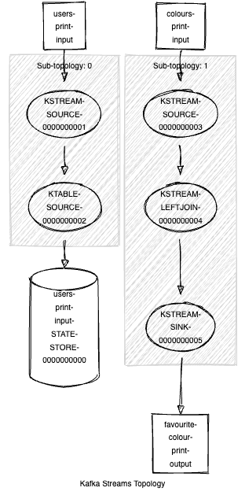

# playground-kafka-streams

This repository contains code that I was using to fiddle around
with [Kafka Streams](https://kafka.apache.org/documentation/streams/).


## How can I play with it myself?

1. Start a local Kafka with `docker compose up`
2. Build with `maven verify`
3. Execute the main methods of the classes/use-cases you're interested in.

## ColourCounter (using a KStream)

### What does it do?

* Thread 1 creates Kafka records with a randomly picked rainbow colour and publishes that record to a
  KStreams source topic.
* Thread 2 uses a Kafka streaming topology to count the occurrence of each colour.
* Thread 3 consumes from the KStreams sink topic and prints the colour and its occurrences.

#### What's the topology exactly?


(Created with https://zz85.github.io/kafka-streams-viz/)

### What does the output look like?

```
...
23:03:52 d.h.p.kafkastreams.StreamingApp - ==========
23:03:52 d.h.p.kafkastreams.StreamingApp - blue occurred 21551 times.
23:03:52 d.h.p.kafkastreams.StreamingApp - cyan occurred 21623 times.
23:03:52 d.h.p.kafkastreams.StreamingApp - green occurred 21580 times.
23:03:52 d.h.p.kafkastreams.StreamingApp - orange occurred 21724 times.
23:03:52 d.h.p.kafkastreams.StreamingApp - red occurred 21490 times.
23:03:52 d.h.p.kafkastreams.StreamingApp - violet occurred 21748 times.
23:03:52 d.h.p.kafkastreams.StreamingApp - yellow occurred 21408 times.
23:03:52 d.h.p.kafkastreams.StreamingApp - ==========
23:03:57 d.h.p.kafkastreams.StreamingApp - ==========
23:03:57 d.h.p.kafkastreams.StreamingApp - blue occurred 21558 times.
23:03:57 d.h.p.kafkastreams.StreamingApp - cyan occurred 21630 times.
23:03:57 d.h.p.kafkastreams.StreamingApp - green occurred 21588 times.
23:03:57 d.h.p.kafkastreams.StreamingApp - orange occurred 21731 times.
23:03:57 d.h.p.kafkastreams.StreamingApp - red occurred 21496 times.
23:03:57 d.h.p.kafkastreams.StreamingApp - violet occurred 21754 times.
23:03:57 d.h.p.kafkastreams.StreamingApp - yellow occurred 21412 times.
23:03:57 d.h.p.kafkastreams.StreamingApp - ==========
...
```

## FavouriteColourCounter (using a KTable)

### What does it do?

* Thread 1 creates Kafka records with a randomly picked rainbow colour concatenated with a randomly picked username and
  publishes that record to a KStreams source topic. The favourite colour of a user can change over time.
* Thread 2 uses a Kafka streaming topology to count how often a colour currently is the favourite one of a user.
* Thread 3 consumes from the KStreams sink topic and prints the colour and its occurrences.

#### What's the topology exactly?


(Created with https://zz85.github.io/kafka-streams-viz/)

### What does the output look like?

```
...
23:05:28 d.h.p.kafkastreams.StreamingApp - ==========
23:05:28 d.h.p.kafkastreams.StreamingApp - Blue occurred 1 times.
23:05:28 d.h.p.kafkastreams.StreamingApp - Cyan occurred 1 times.
23:05:28 d.h.p.kafkastreams.StreamingApp - Green occurred 3 times.
23:05:28 d.h.p.kafkastreams.StreamingApp - Orange occurred 2 times.
23:05:28 d.h.p.kafkastreams.StreamingApp - Red occurred 1 times.
23:05:28 d.h.p.kafkastreams.StreamingApp - Violet occurred 1 times.
23:05:28 d.h.p.kafkastreams.StreamingApp - Yellow occurred 2 times.
23:05:28 d.h.p.kafkastreams.StreamingApp - ==========
23:05:33 d.h.p.kafkastreams.StreamingApp - ==========
23:05:33 d.h.p.kafkastreams.StreamingApp - Blue occurred 2 times.
23:05:33 d.h.p.kafkastreams.StreamingApp - Cyan occurred 2 times.
23:05:33 d.h.p.kafkastreams.StreamingApp - Green occurred 0 times.
23:05:33 d.h.p.kafkastreams.StreamingApp - Orange occurred 1 times.
23:05:33 d.h.p.kafkastreams.StreamingApp - Red occurred 0 times.
23:05:33 d.h.p.kafkastreams.StreamingApp - Violet occurred 3 times.
23:05:33 d.h.p.kafkastreams.StreamingApp - Yellow occurred 3 times.
23:05:33 d.h.p.kafkastreams.StreamingApp - ==========
...
```

## FavouriteColourPrinter (using a KStream joined with a GlobalKTable)

### What does it do?

* Thread 1
    * randomly picks superheros and creates Kafka records with hero-name as key and real name as value and publishes
      that record to a KStreams source topic.
    * creates Kafka records with a randomly picked superhero hero-name as record-key and a randomly picked rainbow
      colour as record-value and publishes that record to a KStreams source topic. The favourite colour of a superhero
      can change over time.
* Thread 2 uses a Kafka streaming topology to join the use and its current favourite colour.
* Thread 3 consumes from the KStreams sink topic and prints the superheros' hero-name, its real name and its current
  favourite colour.

#### What's the topology exactly?



(Created with https://zz85.github.io/kafka-streams-viz/)

### What does the output look like?

```
...
22:40:20 d.h.p.k.FavouriteColourPrinter - Wolverine alias James Howlett now likes 'Yellow' the most
22:40:20 d.h.p.k.FavouriteColourPrinter - Black Widow alias Natasha Alianovna Romanoff now likes 'Blue' the most
22:40:20 d.h.p.k.FavouriteColourPrinter - Captain America alias Steven G. Rogers now likes 'Cyan' the most
22:40:20 d.h.p.k.FavouriteColourPrinter - Black Widow alias Natasha Alianovna Romanoff now likes 'Green' the most
22:40:20 d.h.p.k.FavouriteColourPrinter - Daredevil alias Matt Murdock now likes 'Cyan' the most
22:40:20 d.h.p.k.FavouriteColourPrinter - Daredevil alias Matt Murdock now likes 'Yellow' the most
22:40:20 d.h.p.k.FavouriteColourPrinter - Captain America alias Steven G. Rogers now likes 'Green' the most
22:40:20 d.h.p.k.FavouriteColourPrinter - Captain Marvel alias Carol Danvers now likes 'Red' the most
22:40:20 d.h.p.k.FavouriteColourPrinter - Captain America alias Steven G. Rogers now likes 'Violet' the most
22:40:20 d.h.p.k.FavouriteColourPrinter - Ant-Man alias Scott Lang now likes 'Green' the most
22:40:20 d.h.p.k.FavouriteColourPrinter - Spider-Man alias Peter Parker now likes 'Cyan' the most
22:40:20 d.h.p.k.FavouriteColourPrinter - Iron Man alias Tony Stark now likes 'Green' the most
22:40:20 d.h.p.k.FavouriteColourPrinter - Daredevil alias Matt Murdock now likes 'Violet' the most
22:40:20 d.h.p.k.FavouriteColourPrinter - Deadpool alias Wade Winston Wilson now likes 'Cyan' the most
22:40:20 d.h.p.k.FavouriteColourPrinter - Black Panther alias T'Challa now likes 'Cyan' the most
22:40:20 d.h.p.k.FavouriteColourPrinter - Ant-Man alias Scott Lang now likes 'Blue' the most
22:40:20 d.h.p.k.FavouriteColourPrinter - Wolverine alias James Howlett now likes 'Yellow' the most
22:40:20 d.h.p.k.FavouriteColourPrinter - Wolverine alias James Howlett now likes 'Cyan' the most
22:40:20 d.h.p.k.FavouriteColourPrinter - Captain Marvel alias Carol Danvers now likes 'Orange' the most
22:40:20 d.h.p.k.FavouriteColourPrinter - Iron Man alias Tony Stark now likes 'Cyan' the most
22:40:20 d.h.p.k.FavouriteColourPrinter - Wolverine alias James Howlett now likes 'Blue' the most
22:40:20 d.h.p.k.FavouriteColourPrinter - Wolverine alias James Howlett now likes 'Yellow' the most
22:40:20 d.h.p.k.FavouriteColourPrinter - Captain Marvel alias Carol Danvers now likes 'Orange' the most
22:40:20 d.h.p.k.FavouriteColourPrinter - Ant-Man alias Scott Lang now likes 'Green' the most
22:40:21 d.h.p.k.FavouriteColourPrinter - Captain Marvel alias Carol Danvers now likes 'Blue' the most
22:40:21 d.h.p.k.FavouriteColourPrinter - Ant-Man alias Scott Lang now likes 'Red' the most
22:40:21 d.h.p.k.FavouriteColourPrinter - Wolverine alias James Howlett now likes 'Green' the most
22:40:21 d.h.p.k.FavouriteColourPrinter - Black Widow alias Natasha Alianovna Romanoff now likes 'Orange' the most
22:40:21 d.h.p.k.FavouriteColourPrinter - Deadpool alias Wade Winston Wilson now likes 'Red' the most
22:40:21 d.h.p.k.FavouriteColourPrinter - Black Panther alias T'Challa now likes 'Cyan' the most
22:40:21 d.h.p.k.FavouriteColourPrinter - Ant-Man alias Scott Lang now likes 'Cyan' the most
22:40:21 d.h.p.k.FavouriteColourPrinter - Spider-Man alias Peter Parker now likes 'Orange' the most
22:40:21 d.h.p.k.FavouriteColourPrinter - Ant-Man alias Scott Lang now likes 'Yellow' the most
22:40:22 d.h.p.k.FavouriteColourPrinter - Captain Marvel alias Carol Danvers now likes 'Blue' the most
...
```