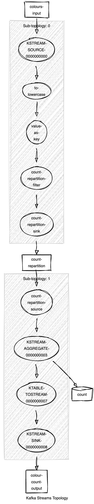
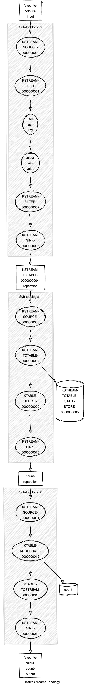

# playground-kafka-streams

This repository contains code that I was using to fiddle around
with [Kafka Streams](https://kafka.apache.org/documentation/streams/).


## How can I play with it myself?

1. Start a local Kafka with `docker compose up`.
2. Build with `maven verify`
3. Execute the main methods of the classes/use-cases you're interested in.

## ColourCounter

### What does it?

* Thread 1 creates Kafka records with a randomly picked rainbow colour and publishes that record to a
  KStreams source topic.
* Thread 2 uses a Kafka streaming topology to count the occurrence of each colour.
* Thread 3 consumes from the KStreams sink topic and prints the colour and its occurrences.

#### What's the topology exactly?



(Created with https://zz85.github.io/kafka-streams-viz/)

### What does the output look like?

```
23:03:52 d.h.p.kafkastreams.StreamingApp - ==========
23:03:52 d.h.p.kafkastreams.StreamingApp - blue occurred 21551 times.
23:03:52 d.h.p.kafkastreams.StreamingApp - cyan occurred 21623 times.
23:03:52 d.h.p.kafkastreams.StreamingApp - green occurred 21580 times.
23:03:52 d.h.p.kafkastreams.StreamingApp - orange occurred 21724 times.
23:03:52 d.h.p.kafkastreams.StreamingApp - red occurred 21490 times.
23:03:52 d.h.p.kafkastreams.StreamingApp - violet occurred 21748 times.
23:03:52 d.h.p.kafkastreams.StreamingApp - yellow occurred 21408 times.
23:03:52 d.h.p.kafkastreams.StreamingApp - ==========
23:03:57 d.h.p.kafkastreams.StreamingApp - ==========
23:03:57 d.h.p.kafkastreams.StreamingApp - blue occurred 21558 times.
23:03:57 d.h.p.kafkastreams.StreamingApp - cyan occurred 21630 times.
23:03:57 d.h.p.kafkastreams.StreamingApp - green occurred 21588 times.
23:03:57 d.h.p.kafkastreams.StreamingApp - orange occurred 21731 times.
23:03:57 d.h.p.kafkastreams.StreamingApp - red occurred 21496 times.
23:03:57 d.h.p.kafkastreams.StreamingApp - violet occurred 21754 times.
23:03:57 d.h.p.kafkastreams.StreamingApp - yellow occurred 21412 times.
23:03:57 d.h.p.kafkastreams.StreamingApp - ==========
```

## FavouriteColourCounter

### What does it?

* Thread 1 creates Kafka records with a randomly picked rainbow colour concatenated with a randomly picked user name and publishes that record to a
  KStreams source topic. The favourite colour of a user can change over time.
* Thread 2 uses a Kafka streaming topology to count how often a colour is the favourite one of a user.
* Thread 3 consumes from the KStreams sink topic and prints the colour and its occurrences.

#### What's the topology exactly?



(Created with https://zz85.github.io/kafka-streams-viz/)

### What does the output look like?

```
23:05:28 d.h.p.kafkastreams.StreamingApp - ==========
23:05:28 d.h.p.kafkastreams.StreamingApp - Blue occurred 1 times.
23:05:28 d.h.p.kafkastreams.StreamingApp - Cyan occurred 1 times.
23:05:28 d.h.p.kafkastreams.StreamingApp - Green occurred 3 times.
23:05:28 d.h.p.kafkastreams.StreamingApp - Orange occurred 2 times.
23:05:28 d.h.p.kafkastreams.StreamingApp - Red occurred 1 times.
23:05:28 d.h.p.kafkastreams.StreamingApp - Violet occurred 1 times.
23:05:28 d.h.p.kafkastreams.StreamingApp - Yellow occurred 2 times.
23:05:28 d.h.p.kafkastreams.StreamingApp - ==========
23:05:33 d.h.p.kafkastreams.StreamingApp - ==========
23:05:33 d.h.p.kafkastreams.StreamingApp - Blue occurred 2 times.
23:05:33 d.h.p.kafkastreams.StreamingApp - Cyan occurred 2 times.
23:05:33 d.h.p.kafkastreams.StreamingApp - Green occurred 0 times.
23:05:33 d.h.p.kafkastreams.StreamingApp - Orange occurred 1 times.
23:05:33 d.h.p.kafkastreams.StreamingApp - Red occurred 0 times.
23:05:33 d.h.p.kafkastreams.StreamingApp - Violet occurred 3 times.
23:05:33 d.h.p.kafkastreams.StreamingApp - Yellow occurred 3 times.
23:05:33 d.h.p.kafkastreams.StreamingApp - ==========
```